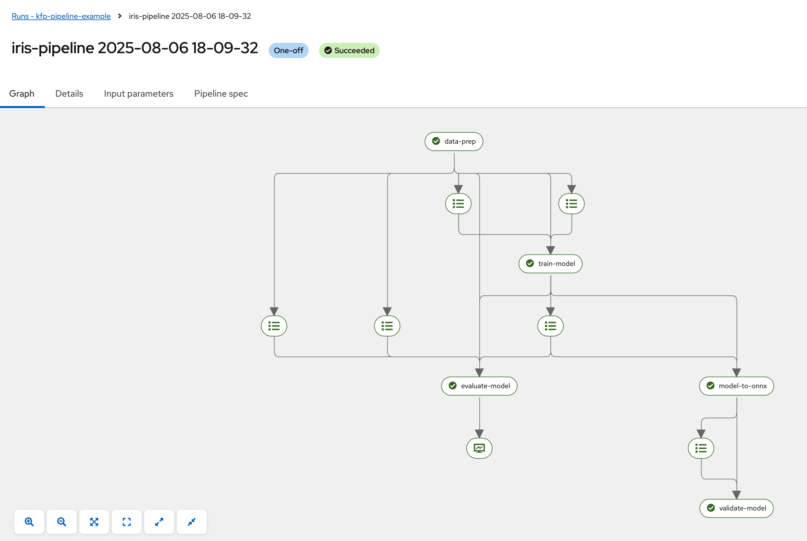

# KFP Pipeline Example

This example deploys a Tekton pipeline that builds an image based on an example [Iris pipeline](https://github.com/redhat-ai-services/kubeflow-pipelines-examples/blob/main/pipelines/11_iris_training_pipeline.py), and then triggers an execution of the KFP pipeline.



## Dependencies

This example requires a cluster with the following components:
* OpenShift AI
  * DataSciencePipelines
* OpenShift Pipelines (Tekton)

## Overview

This example contains the following components:

* `namespaces`: Used to configure the namespaces required for the example
* `dspa`: Used to deploy the Data Science Pipeline Application instance
* `minio`: Used to deploy MinIO object storage for pipeline artifacts and data
* `tekton-pipeline`: Used to deploy Tekton pipeline resources including:
  - Pipeline definitions for data science workflows
  - Pipeline runs and execution tasks
  - RBAC configurations for pipeline execution
  - ImageStream configurations for container images

## Quick Start

### 1. Deploy Using Bootstrap Script

From the repository root:
```bash
./scripts/bootstrap.sh
```
1. Select `kfp-pipeline-example` from the examples list
2. Choose your desired overlay (default will be automatically selected if that is the only option)

## Troubleshooting


## Cleanup

To remove the deployment:

```bash
# Remove ArgoCD application
oc delete -k examples/kfp-pipeline-example/argocd/overlays/default -n openshift-gitops
```
